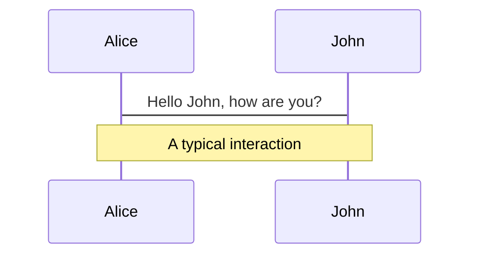
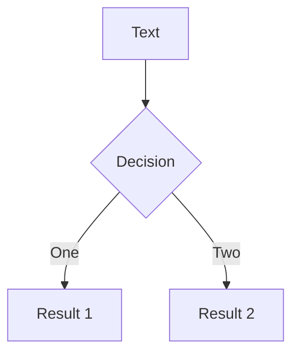

---
# try also 'default' to start simple
theme: seriph
# random image from a curated Unsplash collection by Anthony
# like them? see https://unsplash.com/collections/94734566/slidev
background: /erik-mclean-za3ADPq8mpo-unsplash.jpg
class: 'text-center'
# https://sli.dev/custom/highlighters.html
highlighter: shiki
# show line numbers in code blocks
lineNumbers: false
# some information about the slides, markdown enabled
info: |
  ## Slidev Starter Template
  Presentation slides for developers.

  Learn more at [Sli.dev](https://sli.dev)
# persist drawings in exports and build
drawings:
  persist: false
---

# 创新中心2021年度总结

By Zach Zhao

<!--
你们看不见的吧
-->

---

# 创新中心2021回顾


- 📝 帮助中心的过渡性迁移 <span class="hl">（基于 Next.js 和 Nest.js) </span>
- 🎨 帮助中心的彻底的重构 <span class="hl">（基于 Next.js 和 Nest.js) </span>
- 🧑‍💻 ShopExpress 和 TeamPro 官方网站搭建 <span class="hl">（基于 Next.js 搭建的多站点）</span>
- 🐒 Take over 盟聚官网
- 🤹 推广页面的低代码平台的完善<span class="hl">（运营共创建线上页面 20+）</span>
- 🧔🏼‍♂️ 推广定制化页面<span class="hl">（PC 和 Mobile 共计 20+）</span>
- 🎥 配合干禧的登录注册门户改造 <span class="hl">（移交给奇文组) </span>
- 🛠 官网和各子官网的日常维护和迭代<span class="hl">（案例库重整）</span>
- 📤 官网整体重构 <span class="hl">（筹划中）</span>


---

# 帮助中心的架构迁移

<iframe style="border:none" width="800" height="450" src="https://whimsical.com/embed/3GvaXRZ7nFwRpk6dJAJsq8"></iframe>

---

# 帮助中心迁移

- 共迁移文章2000+

- 数据库表从2张表扩展到10张表 <span class="hl"> --- 整体设计更加灵活 </span>

- 前端技术栈从Angular 1.x迁移到最新的Next.js <span class="hl"> --- 开发体验和性能提升一个Level </span>

- 后端技术栈从 Java 迁移到最新的Nest.js  <span class="hl"> --- 代码量减少了2/3  </span>

- 所有端都采用了Typescript增强代码的健壮性和可维护性 <span class="hl"> --- 编译期发现更多问题 </span>

- 所有代码基都统一用Prettier进行代码格式化，Eslint进行风格检查  <span class="hl">  --- 保持团队代码风格一致 </span>

- 有意识的选用一些Rust Based的Tooling(Swc和Prisma)去提高开发体验和性能  <span class="hl"> --- 可以战未来 </span>

---

# 帮助中心后台文章编辑器增强

<div grid="~ cols-3 gap-4" class="mt-10">
<div>

- 提供文章大纲功能，跟随锚点自动定位

- 能够复制粘贴第三方编辑器(腾讯文档、语雀)的图文内容（第三方图片链接自动批量转存CDN）

- 支持多图复制粘贴自动上传

- 粘贴富文本时自动去除多余的样式
</div>
<div class="col-span-2">
  
</div>
</div>


---


# Code

Use code snippets and get the highlighting directly![^1]

```ts {all|2|1-6|9|all}
interface User {
  id: number
  firstName: string
  lastName: string
  role: string
}

function updateUser(id: number, update: User) {
  const user = getUser(id)
  const newUser = {...user, ...update}  
  saveUser(id, newUser)
}
```

<arrow v-click="3" x1="400" y1="420" x2="230" y2="330" color="#564" width="3" arrowSize="1" />

[^1]: [Learn More](https://sli.dev/guide/syntax.html#line-highlighting)

<style>
.footnotes-sep {
  @apply mt-20 opacity-10;
}
.footnotes {
  @apply text-sm opacity-75;
}
.footnote-backref {
  display: none;
}
</style>

---

# Components

<div grid="~ cols-2 gap-4">
<div>

You can use Vue components directly inside your slides.

We have provided a few built-in components like `<Tweet/>` and `<Youtube/>` that you can use directly. And adding your custom components is also super easy.

```html
<Counter :count="10" />
```

<!-- ./components/Counter.vue -->
<Counter :count="10" m="t-4" />

Check out [the guides](https://sli.dev/builtin/components.html) for more.

</div>
<div>

```html
<Tweet id="1390115482657726468" />
```

<Tweet id="1390115482657726468" scale="0.65" />

</div>
</div>


---
class: px-20
---

# Themes

Slidev comes with powerful theming support. Themes can provide styles, layouts, components, or even configurations for tools. Switching between themes by just **one edit** in your frontmatter:

<div grid="~ cols-2 gap-2" m="-t-2">

```yaml
---
theme: default
---
```

```yaml
---
theme: seriph
---
```


</div>

Read more about [How to use a theme](https://sli.dev/themes/use.html) and
check out the [Awesome Themes Gallery](https://sli.dev/themes/gallery.html).

---
preload: false
---

# Animations

Animations are powered by [@vueuse/motion](https://motion.vueuse.org/).

```html
<div
  v-motion
  :initial="{ x: -80 }"
  :enter="{ x: 0 }">
  Slidev
</div>
```

<div class="w-60 relative mt-6">
  <div class="relative w-40 h-40">
    
    
    
  </div>

  <div 
    class="text-5xl absolute top-14 left-40 text-[#2B90B6] -z-1"
    v-motion
    :initial="{ x: -80, opacity: 0}"
    :enter="{ x: 0, opacity: 1, transition: { delay: 2000, duration: 1000 } }">
    Slidev
  </div>
</div>

<!-- vue script setup scripts can be directly used in markdown, and will only affects current page -->
<script setup lang="ts">
const final = {
  x: 0,
  y: 0,
  rotate: 0,
  scale: 1,
  transition: {
    type: 'spring',
    damping: 10,
    stiffness: 20,
    mass: 2
  }
}
</script>

<div
  v-motion
  :initial="{ x:35, y: 40, opacity: 0}"
  :enter="{ y: 0, opacity: 1, transition: { delay: 3500 } }">

[Learn More](https://sli.dev/guide/animations.html#motion)

</div>

---

# LaTeX

LaTeX is supported out-of-box powered by [KaTeX](https://katex.org/).

<br>

Inline $\sqrt{3x-1}+(1+x)^2$

Block
$$
\begin{array}{c}

\nabla \times \vec{\mathbf{B}} -\, \frac1c\, \frac{\partial\vec{\mathbf{E}}}{\partial t} &
= \frac{4\pi}{c}\vec{\mathbf{j}}    \nabla \cdot \vec{\mathbf{E}} & = 4 \pi \rho \\

\nabla \times \vec{\mathbf{E}}\, +\, \frac1c\, \frac{\partial\vec{\mathbf{B}}}{\partial t} & = \vec{\mathbf{0}} \\

\nabla \cdot \vec{\mathbf{B}} & = 0

\end{array}
$$

<br>

[Learn more](https://sli.dev/guide/syntax#latex)

---

# Diagrams

You can create diagrams / graphs from textual descriptions, directly in your Markdown.

<div class="grid grid-cols-2 gap-10 pt-4 -mb-6">





</div>

[Learn More](https://sli.dev/guide/syntax.html#diagrams)


---
layout: center
class: text-center
---

# Learn More

[Documentations](https://sli.dev) · [GitHub](https://github.com/slidevjs/slidev) · [Showcases](https://sli.dev/showcases.html)
